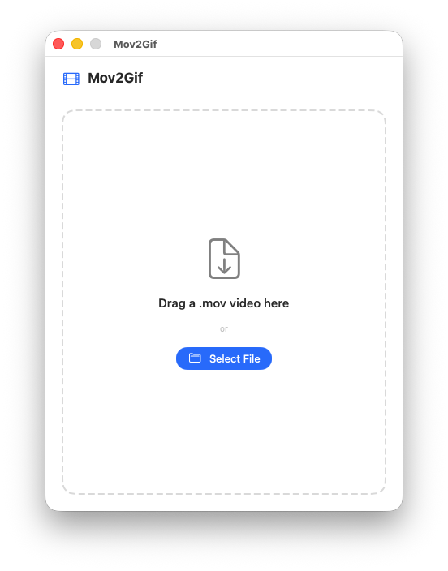

# Mov2Gif



A native macOS application designed to convert .mov video files into .gif animated images quickly and easily. Built entirely with Swift and SwiftUI, ensuring maximum performance and complete integration with the macOS ecosystem.

## Features

- Native Conversion: Utilizes AVFoundation and ImageIO for processing. No external dependencies or command-line tools like FFmpeg are required.
- Drag and Drop Interface: Simply drag a .mov file into the application window to start the conversion.
- Customizable Output: Adjust scale, frame rate (FPS), and quality before converting.
- Mac App Store Compliant: Fully sandboxed and built to comply with Apple's strict guidelines for standalone applications.
- Localization: Supports English (default) and Brazilian Portuguese.

## Requirements

- macOS 12.0 or later (or the minimum deployment target specified in the project)
- Xcode (for building from source)

## Installation

You can easily install Mov2Gif using Homebrew:

```bash
brew install --cask carlosxfelipe/tap/mov2gif
```

## Building the Project

1. Open `Mov2Gif.xcodeproj` in Xcode.
2. Select the `Mov2Gif` target.
3. Build and Run the application (Cmd + R).

## Architecture and Guidelines

This project strictly adheres to the macOS App Sandbox constraints. All file access is explicitly granted by the user through native panels (NSOpenPanel and NSSavePanel), and all core logic is implemented natively to ensure it is suitable for distribution on the Mac App Store.

## License

This project is licensed under the GNU General Public License v3.0 (GPL-3.0) - a strong copyleft license. This ensures that any modifications or derivative works must also be open source and distributed under the same terms.
